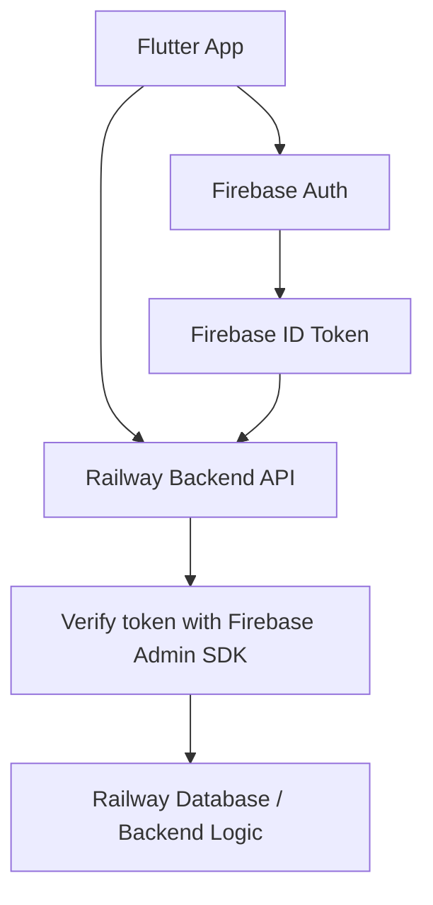

# Auth Architecture Reference

Recommended auth setup for this Flutter app:

- **Firebase Authentication** for user authentication
- **Railway backend** for API/business logic/database access
- **Firebase ID tokens** passed from the Flutter app to the Railway API
- **Firebase Admin SDK** on the Railway backend to verify tokens

## Architecture



## Why Firebase Auth Fits This Project

Firebase Auth is a strong fit because this is a **Flutter mobile app** and the app needs a smooth mobile authentication flow, especially for **Google Sign-In**.

Firebase Auth can be used by itself. The app does **not** need to use Firebase Firestore, Realtime Database, Cloud Functions, Hosting, or Storage if Railway is already handling the backend.

## Supported Auth Methods

Recommended auth methods:

- Email/password login
- Google Sign-In
- Apple Sign-In for iOS
- Password reset
- Persistent user sessions

> Note: If the iOS app offers third-party login such as Google, Apple generally requires Sign in with Apple as an option too.

## Request Flow

1. User signs in inside the Flutter app using Firebase Auth.
2. Firebase returns an authenticated user session.
3. Flutter gets the current user’s Firebase ID token.
4. Flutter sends API requests to the Railway backend with the token:

```http
Authorization: Bearer FIREBASE_ID_TOKEN
```

5. The Railway backend verifies the token using the Firebase Admin SDK.
6. After verification, the backend can safely identify the user by Firebase `uid`.
7. Backend uses that `uid` to look up or create the app user in the Railway database.

## Backend User Mapping

Store the Firebase UID in the backend database as the stable user identifier.

Example user record:

```txt
firebase_uid: "abc123"
email: "user@gmail.com"
name: "John Doe"
provider: "google.com"
```

The backend should treat `firebase_uid` as the trusted external auth ID.

## Flutter Packages To Consider

Common Flutter packages for this setup:

```yaml
firebase_core
firebase_auth
google_sign_in
sign_in_with_apple
```

## Backend Notes

On the Railway backend:

- Install the Firebase Admin SDK for the backend language/framework being used.
- Load Firebase service account credentials securely through Railway environment variables.
- Never hardcode service account secrets in the Flutter app or repository.
- Verify every protected API request server-side.
- Use the verified Firebase `uid` to authorize user-specific data access.

## Final Recommendation

Use **Firebase Authentication only** for auth, and keep **Railway** as the main backend.

This keeps the mobile sign-in experience simple while allowing the backend to remain fully custom and controlled through Railway.
